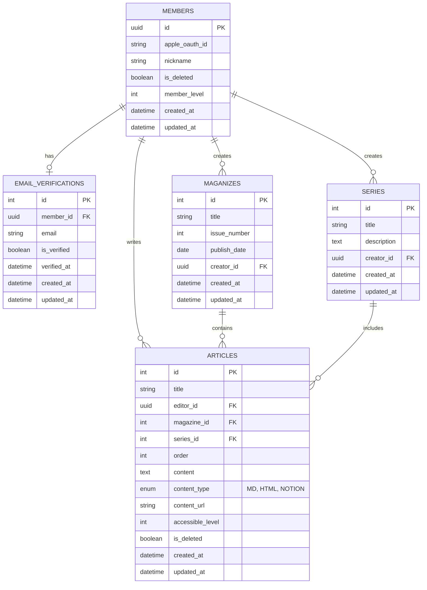

```mermaid
erDiagram
    MEMBERS||--o{ ARTICLES : writes
    MEMBERS ||--o| EMAIL_VERIFICATIONS : has
    MAGANIZES ||--o{ ARTICLES : contains
    MEMBERS ||--o{ MAGANIZES : creates
    SERIES ||--o{ ARTICLES : includes
    MEMBERS ||--o{ SERIES : creates

    MEMBERS {
        uuid id PK
        string apple_oauth_id
        string nickname
        boolean is_deleted
        int member_level
        datetime created_at
        datetime updated_at
    }

    EMAIL_VERIFICATIONS {
        int id PK
        uuid member_id FK
        string email
        boolean is_verified
        datetime verified_at
        datetime created_at
        datetime updated_at
    }

    MAGANIZES {
        int id PK
        string title
        int issue_number
        date publish_date
        uuid creator_id FK
        datetime created_at
        datetime updated_at
    }

    SERIES {
        int id PK
        string title
        text description
        uuid creator_id FK
        datetime created_at
        datetime updated_at
    }

    ARTICLES {
        int id PK
        string title
        uuid editor_id FK
        int magazine_id FK
        int series_id FK
        int order
        text content
        enum content_type "MD, HTML, NOTION"
        string content_url
        int accessible_level
        boolean is_deleted
        datetime created_at
        datetime updated_at
    }
```
